# Syllago Architecture

## Overview

Syllago is a CLI and TUI for managing AI coding tool content (rules, skills, agents, hooks, MCP configs, commands, loadouts) across providers. Built in Go using the Cobra CLI framework and Bubble Tea TUI framework. All provider conversions go through syllago's own canonical format as a hub.

## Container Diagram

```mermaid
graph TB
    %% ===== Entry Points =====
    subgraph Entry["Entry Points"]
        CLI["cmd/syllago<br/>(Cobra commands)"]
        TUI["internal/tui<br/>(Bubble Tea app)"]
    end

    %% ===== Content Ingestion =====
    subgraph Ingest["Content Ingestion"]
        Add["add<br/>(filesystem + git sources)"]
        Discover["discover<br/>(find monolithic rule files)"]
        Splitter["splitter<br/>(split CLAUDE.md/AGENTS.md/etc.)"]
        Analyzer["analyzer<br/>(detect content type + confidence)"]
        Parse["parse<br/>(YAML / TOML / JSON helpers)"]
        Metadata["metadata<br/>(.syllago.yaml, SKILL.md, AGENT.md)"]
        ContentFmt["contentformat<br/>(canonical enums)"]
    end

    %% ===== Catalog & Storage =====
    subgraph Storage["Catalog & Storage"]
        Catalog["catalog<br/>(scan + index library)"]
        Rulestore["rulestore<br/>(rule write/load/hash)"]
        Config["config<br/>(global + project + paths)"]
        Snapshot["snapshot<br/>(all-or-nothing backups)"]
    end

    %% ===== Conversion Hub =====
    subgraph Convert["Conversion Hub (spoke ↔ canonical ↔ spoke)"]
        Converter["converter<br/>(MDC / TOML / JSON / YAML)"]
        Provider["provider<br/>(11 supported tools + detection)"]
    end

    %% ===== Installation =====
    subgraph Install["Installation"]
        Installer["installer<br/>(symlinks + JSON merge for hooks/MCP)"]
        Loadout["loadout<br/>(BuildManifest, apply, preview)"]
        InstallCheck["installcheck<br/>(state + drift scan)"]
        Promote["promote<br/>(local → shared)"]
        Sandbox["sandbox<br/>(bubblewrap isolation)"]
    end

    %% ===== Registry & Trust (MOAT) =====
    subgraph Trust["Registry & Trust"]
        Registry["registry<br/>(git-based registries)"]
        MOAT["moat<br/>(sigstore verify + bundles)"]
        Signing["signing<br/>(hook content signatures)"]
        GitUtil["gitutil<br/>(clone/pull/status/diff)"]
    end

    %% ===== Capability Monitoring =====
    subgraph Capmon["Capability Monitoring"]
        CapMon["capmon<br/>(provider capability cache)"]
        ProvMon["provmon<br/>(manifest + source-hash checker)"]
        Audit["audit<br/>(structured JSON audit log)"]
    end

    %% ===== Diagnostics & Ops =====
    subgraph Ops["Diagnostics & Ops"]
        Doctor["doctor<br/>(health checks)"]
        Output["output<br/>(StructuredError, --json/--quiet)"]
        ErrorDocs["errordocs<br/>(embedded --explain markdown)"]
        Telemetry["telemetry<br/>(opt-in PostHog events)"]
        Updater["updater<br/>(self-update from GH releases)"]
    end

    %% ===== Edges: entry points fan out =====
    CLI --> Add
    CLI --> Loadout
    CLI --> Installer
    CLI --> Converter
    CLI --> Registry
    CLI --> Doctor
    CLI --> CapMon
    CLI --> Updater
    CLI --> Output
    CLI --> Telemetry

    TUI --> Catalog
    TUI --> Add
    TUI --> Loadout
    TUI --> Installer
    TUI --> Registry
    TUI --> MOAT
    TUI --> Config

    %% ===== Data flow: Add path =====
    Add --> Discover
    Add --> Analyzer
    Discover --> Splitter
    Splitter --> Metadata
    Analyzer --> ContentFmt
    Add --> Parse
    Add --> Converter
    Converter --> Catalog
    Catalog --> Rulestore

    %% ===== Data flow: Install path =====
    Loadout --> Catalog
    Loadout --> Snapshot
    Loadout --> Installer
    Installer --> Converter
    Installer --> Provider
    Installer --> InstallCheck
    Installer --> Audit

    %% ===== Trust integrations =====
    Registry --> GitUtil
    Registry --> MOAT
    MOAT --> Signing
    Add --> Registry
    Promote --> GitUtil

    %% ===== Capability + provider awareness =====
    CapMon --> Provider
    ProvMon --> Provider
    Doctor --> Config
    Doctor --> Provider
    Doctor --> InstallCheck

    %% ===== Cross-cutting =====
    Output --> ErrorDocs
    Config --> Provider

    %% ===== Styling =====
    classDef entry fill:#1e3a5f,stroke:#4a90d9,color:#fff
    classDef hub fill:#3d2a4e,stroke:#a06bc9,color:#fff
    classDef trust fill:#3d3520,stroke:#c9a86b,color:#fff
    class CLI,TUI entry
    class Converter,Provider hub
    class Registry,MOAT,Signing,GitUtil trust
```



## Package Map

### cmd/syllago/

CLI entry point and Cobra command definitions. Each command has its own `*_cmd.go` file. Commands call into `internal/` packages for business logic -- the command files themselves contain minimal logic (flag wiring, output formatting).

### internal/add/

Content discovery and addition. Used by both `syllago add` and the TUI import wizard. Handles local filesystem and git URL sources.

### internal/catalog/

Content scanning, indexing, and querying. The source of truth for what is in the library. Provides `Scan()` (project), `ScanWithGlobalAndRegistries()` (merged), and query methods by type, name, and source. Includes `PrimaryFileName()` and `ReadFileContent()` for file-level access.

### internal/config/

User configuration management. Stores provider selection, custom install paths, and registry list. `PathResolver` implements `ProviderPathLookup` for custom path overrides. Global config at `~/.syllago/config.json`; project config at `.syllago/config.json`. `config.Merge()` combines both.

### internal/converter/

Hub-and-spoke format conversion. All conversions go: source format -> canonical -> target format. Never converts directly between two non-canonical providers. Handles MDC (Cursor), TOML (Codex agents), JSON (Kiro), and YAML (OpenCode) edge cases automatically.

### internal/gitutil/

Git operations used by registry and import flows: clone, pull, status, diff. Thin wrappers around `os/exec` git invocations.

### internal/installer/

Provider-specific installation logic. Hooks and MCP configs use JSON merge into the provider's settings file; all other content types use filesystem operations (symlinks or file copies). Tracks installed items in `.syllago/installed.json`.

### internal/loadout/

Loadout engine: `BuildManifest()`, `WriteManifest()`, apply, preview, and remove. Shared by CLI commands and the TUI wizard. Delegates to the snapshot package for all-or-nothing apply/revert.

### internal/metadata/

Content metadata parsing. Reads `.syllago.yaml`, `SKILL.md`, and `AGENT.md` files to extract name, description, version, and tags.

### internal/model/

Shared data types used across packages. Defines `ContentItem`, `InstallRecord`, and other value types to avoid circular imports.

### internal/output/

CLI output formatting for non-TUI code. `StructuredError` type with 17 error code constants. Supports `--json`, `--quiet`, and `--no-color` modes. `PrintStructuredError()` for consistent machine-readable error output.

### internal/parse/

File parsing utilities. Shared helpers for reading YAML, TOML, and JSON content files.

### internal/promote/

Local-to-shared content promotion. Implements the `syllago share` workflow for contributing library content to a team repository.

### internal/provider/

Provider detection and path resolution for all supported tools (Claude Code, Cursor, Windsurf, Codex, Gemini CLI, Copilot CLI, Cline, Roo Code, Zed, OpenCode, Kiro). `AllProviders` is the authoritative list. `DetectProvidersWithResolver()` checks default paths and custom overrides.

### internal/registry/

Git-based registry management. Clone, sync, remove, and manifest parsing. Registries are git repos following the syllago content layout. Registry names use `owner/repo` format.

### internal/sandbox/

Bubblewrap-based process isolation for AI CLI tools (Linux only). Sandbox configuration model -- the actual sandbox execution is in `cmd/syllago/sandbox_cmd.go`.

### internal/snapshot/

Snapshot management for loadout apply/revert. Stores backups in `.syllago/snapshots/`. All-or-nothing: either the full loadout applies successfully or the snapshot restores the previous state.

### internal/tui/

Bubble Tea TUI application. Card grid pages (Library, Loadouts, Registries), item list/detail views, and wizard screens (import, loadout create, update, settings). Calls into `internal/` packages for business logic; adds interactive chrome (navigation, modals, toasts, breadcrumbs). See `.claude/rules/tui-*.md` for enforced component patterns.

### internal/updater/

Self-update logic for release builds. Downloads the latest release from GitHub Releases, verifies SHA-256 checksum, and replaces the binary atomically.

## Data Flow

```
Add:        Source (filesystem/git) -> Scanner -> Canonical Format -> Library Store
Install:    Library Store -> Converter -> Provider Format -> Installer -> Provider Location
Convert:    Provider Format -> Canonical Format -> Target Provider Format
Loadout:    loadout.yaml -> Resolver -> Snapshot -> Installer (per item) -> Installed
```

## Conversion Model

Hub-and-spoke through syllago's canonical format:

```
Cursor MDC ---+                +--- Windsurf rule
Gemini YAML --+--> [Canonical] +--> Kiro JSON
TOML agent ---+                +--- Cline rule
```

- **Add**: Provider format -> canonicalize -> store in library
- **Install**: Load from library -> convert to target format -> install

## Key Conventions

- CLI commands wire flags and call internal packages; minimal logic in command files
- TUI calls the same internal packages and adds navigation, modals, and visual chrome
- Hooks and MCP use JSON merge into provider settings files; all other content types use filesystem (symlinks or file copies)
- `installed.json` tracks all installed items for clean uninstall
- Tests: table-driven with `t.Run()`, `t.TempDir()` for fixtures, no mocking library (hand-crafted stubs)
- Golden files for TUI visual regression; regenerate with `go test ./internal/tui/ -update-golden`

## Development Workflow

Syllago uses a two-layer tracking system:

- **GitHub Issues** are the public intake channel. Bug reports, feature requests, and improvement ideas all start here. Issues are the source of truth for *what* gets built and *why*.
- **Beads** (`.beads/`) are the internal execution tracker. When work begins on an issue, a bead is created to track implementation progress, dependencies, and blockers. Beads are optimized for AI-augmented development -- they persist across sessions and support dependency graphs.

The flow is: **GitHub Issue** (problem/idea) -> **Bead** (implementation tracking) -> **Commit** (code change). Not every bead maps 1:1 to a GitHub issue -- some are discovered work, internal refactors, or subtasks that don't need public visibility.
