# Syllago Architecture

## Overview

Syllago is a CLI and TUI for managing AI coding tool content (rules, skills, agents, hooks, MCP configs, commands, loadouts) across providers. Built in Go using the Cobra CLI framework and Bubble Tea TUI framework. All provider conversions go through syllago's own canonical format as a hub.

The codebase is organized into three layers: the entry-point binaries (`cli/cmd/`), the internal packages (`cli/internal/`) that implement the business logic, and the spec documents (`docs/spec/`) that define provider-neutral interchange formats. Significant architectural choices are recorded as ADRs in [`docs/adr/`](docs/adr/) — see [`docs/adr/INDEX.md`](docs/adr/INDEX.md) before modifying files in a listed scope.

## Container Diagram

```mermaid
graph TB
    %% ===== Entry Points =====
    subgraph Entry["Entry Points"]
        CLI["cmd/syllago<br/>(Cobra commands)"]
        TUI["internal/tui<br/>(Bubble Tea app)"]
    end

    %% ===== Content Ingestion =====
    subgraph Ingest["Content Ingestion"]
        Add["add<br/>(filesystem + git sources)"]
        Discover["discover<br/>(find monolithic rule files)"]
        Splitter["splitter<br/>(split CLAUDE.md/AGENTS.md/etc.)"]
        Analyzer["analyzer<br/>(detect content type + confidence)"]
        Parse["parse<br/>(YAML / TOML / JSON helpers)"]
        Metadata["metadata<br/>(.syllago.yaml, SKILL.md, AGENT.md)"]
        ContentFmt["contentformat<br/>(canonical enums)"]
    end

    %% ===== Catalog & Storage =====
    subgraph Storage["Catalog & Storage"]
        Catalog["catalog<br/>(scan + index library)"]
        Rulestore["rulestore<br/>(rule write/load/hash)"]
        Config["config<br/>(global + project + paths)"]
        Snapshot["snapshot<br/>(all-or-nothing backups)"]
    end

    %% ===== Conversion Hub =====
    subgraph Convert["Conversion Hub (spoke ↔ canonical ↔ spoke)"]
        Converter["converter<br/>(MDC / TOML / JSON / YAML)"]
        Provider["provider<br/>(15 supported tools + detection)"]
    end

    %% ===== Installation =====
    subgraph Install["Installation"]
        Installer["installer<br/>(symlinks + JSON merge for hooks/MCP)"]
        Loadout["loadout<br/>(BuildManifest, apply, preview)"]
        InstallCheck["installcheck<br/>(state + drift scan)"]
        Promote["promote<br/>(local → shared)"]
        Sandbox["sandbox<br/>(bubblewrap isolation)"]
        MoatInstall["moatinstall<br/>(verified clone+install)"]
    end

    %% ===== Registry & Trust (MOAT) =====
    subgraph Trust["Registry & Trust"]
        Registry["registry<br/>(git-based registries)"]
        RegistryOps["registryops<br/>(CLI/TUI orchestration)"]
        MOAT["moat<br/>(Sigstore + Rekor + OIDC pinning)"]
        Signing["signing<br/>(hook content signatures)"]
        GitUtil["gitutil<br/>(clone/pull/status/diff)"]
    end

    %% ===== Capability Monitoring =====
    subgraph Capmon["Capability Monitoring"]
        CapMon["capmon<br/>(extract + recognize + diff pipeline)"]
        ProvMon["provmon<br/>(manifest + source-hash checker)"]
        Audit["audit<br/>(structured JSON audit log)"]
    end

    %% ===== Diagnostics & Ops =====
    subgraph Ops["Diagnostics & Ops"]
        Doctor["doctor<br/>(health checks)"]
        Output["output<br/>(StructuredError, --json/--quiet)"]
        ErrorDocs["errordocs<br/>(embedded --explain markdown)"]
        Telemetry["telemetry<br/>(opt-in PostHog + drift catalog)"]
        Updater["updater<br/>(self-update from GH releases)"]
    end

    %% ===== Edges: entry points fan out =====
    CLI --> Add
    CLI --> Loadout
    CLI --> Installer
    CLI --> Converter
    CLI --> Registry
    CLI --> Doctor
    CLI --> CapMon
    CLI --> Updater
    CLI --> Output
    CLI --> Telemetry
    CLI --> Sandbox

    TUI --> Catalog
    TUI --> Add
    TUI --> Loadout
    TUI --> Installer
    TUI --> RegistryOps
    TUI --> MOAT
    TUI --> Config

    %% ===== Data flow: Add path =====
    Add --> Discover
    Add --> Analyzer
    Discover --> Splitter
    Splitter --> Metadata
    Analyzer --> ContentFmt
    Add --> Parse
    Add --> Converter
    Converter --> Catalog
    Catalog --> Rulestore

    %% ===== Data flow: Install path =====
    Loadout --> Catalog
    Loadout --> Snapshot
    Loadout --> Installer
    Installer --> Converter
    Installer --> Provider
    Installer --> InstallCheck
    Installer --> Audit
    MoatInstall --> Installer
    MoatInstall --> MOAT

    %% ===== Trust integrations =====
    Registry --> GitUtil
    Registry --> MOAT
    RegistryOps --> Registry
    RegistryOps --> MOAT
    MOAT --> Signing
    Add --> Registry
    Promote --> GitUtil

    %% ===== Capability + provider awareness =====
    CapMon --> Provider
    ProvMon --> Provider
    Doctor --> Config
    Doctor --> Provider
    Doctor --> InstallCheck

    %% ===== Cross-cutting =====
    Output --> ErrorDocs
    Config --> Provider

    %% ===== Styling =====
    classDef entry fill:#1e3a5f,stroke:#4a90d9,color:#fff
    classDef hub fill:#3d2a4e,stroke:#a06bc9,color:#fff
    classDef trust fill:#3d3520,stroke:#c9a86b,color:#fff
    class CLI,TUI entry
    class Converter,Provider hub
    class Registry,RegistryOps,MOAT,Signing,GitUtil trust
```



## Package Map

### cmd/syllago/

CLI entry point and Cobra command definitions. Each command has its own `*_cmd.go` file. Commands call into `internal/` packages for business logic — the command files themselves contain minimal logic (flag wiring, output formatting, telemetry enrichment).

Code-generation tooling lives alongside the regular commands as `gen*.go` files: `gendocs.go` regenerates `commands.json` from the cobra tree, `genproviders.go` regenerates `providers.json` from the provider registry, `gencapabilities.go` and `gencontentformat.go` regenerate capability and format tables, `gentelemetry.go` regenerates `telemetry.json` and runs the catalog drift-detection test, and `genyamlschema.go` regenerates the JSON Schema for `.syllago.yaml`. Pre-push hooks block pushes when these are stale.

### internal/add/

Content discovery and addition. Used by both `syllago add` and the TUI import wizard. Handles local filesystem and git URL sources.

### internal/analyzer/

Content type detection with confidence scoring. ADR 0002 (strict) defines this as the hub; ADR 0004 (strict) requires hooks and MCP to always route to user confirmation regardless of confidence. ADR 0005 (advisory) defines tie-breaking precedence: syllago-namespaced > named providers > top-level.

### internal/audit/

Structured JSON audit logging for content and hook lifecycle events. Two files; small surface, opt-in via config.

### internal/capmon/

Capability monitoring pipeline. Extracts AI-tool capabilities from upstream documentation in seven source formats (HTML, Markdown, Go, Rust, TypeScript, JSON Schema, YAML, TOML), recognizes them against per-provider patterns, and diffs against the cached state to surface drift. Stages: `fetch` (chromedp + GitHub API) → `extract_*` (per-format extractors) → `derive` (per-provider recognizers) → `diff` (CSV / SIEM-friendly output) → `check` (CI gate). Backed by `cli/internal/capmon/testdata/fixtures/`. Driven by `syllago capmon` subcommands; CI runs the pipeline daily via `.github/workflows/capmon.yml`.

### internal/catalog/

Content scanning, indexing, and querying. The source of truth for what is in the library. Provides `Scan()` (project), `ScanWithGlobalAndRegistries()` (merged), and query methods by type, name, and source. Includes `PrimaryFileName()` and `ReadFileContent()` for file-level access. Manifest-first scanner path is governed by ADRs 0003 and 0006 (both strict).

### internal/config/

User configuration management. Stores provider selection, custom install paths, and registry list. `PathResolver` implements `ProviderPathLookup` for custom path overrides. Global config at `~/.syllago/config.json`; project config at `.syllago/config.json`. `config.Merge()` combines both.

### internal/contentformat/

Canonical enum values for `.syllago.yaml` metadata fields. Single-file package consumed by analyzers, scanners, and the TUI.

### internal/converter/

Hub-and-spoke format conversion. All conversions go: source format → canonical → target format. Never converts directly between two non-canonical providers. Handles MDC (Cursor), TOML (Codex agents), JSON (Kiro), and YAML (OpenCode) edge cases. ADR 0001 (strict) governs hook degradation enforcement during conversion.

### internal/discover/

Finds monolithic rule files (CLAUDE.md, AGENTS.md, GEMINI.md, .cursorrules, .clinerules, .windsurfrules) under a project root. Used by the splitter and the import wizard.

### internal/doctor/

Health checks for the CLI and TUI: detected providers, config consistency, registry connectivity, install drift. Backs `syllago doctor` and the TUI doctor screen.

### internal/errordocs/

Embeds error documentation markdown files into the binary and provides lookup by error code (Rust `--explain`-style). Used by `syllago explain CODE` and surfaced as `Docs:` URLs in structured error output. Markdown source lives at `cli/internal/errordocs/docs/`.

### internal/gitutil/

Git operations used by registry and import flows: clone, pull, status, diff. Thin wrappers around `os/exec` git invocations.

### internal/installcheck/

Cross-references `installed.json` against actual bytes on disk to detect rule-append drift, missing items, or unexpected modifications. Backs `syllago doctor` and parts of the install flow.

### internal/installer/

Provider-specific installation logic. Hooks and MCP configs use JSON merge into the provider's settings file; all other content types use filesystem operations (symlinks or file copies). Tracks installed items in `.syllago/installed.json`.

### internal/loadout/

Loadout engine: `BuildManifest()`, `WriteManifest()`, apply, preview, and remove. Shared by CLI commands and the TUI wizard. Delegates to the snapshot package for all-or-nothing apply/revert.

### internal/metadata/

Content metadata parsing. Reads `.syllago.yaml`, `SKILL.md`, and `AGENT.md` files to extract name, description, version, and tags.

### internal/moat/

Reference implementation of [MOAT](https://github.com/OpenScribbler/moat). Verifies registry and per-item content via Sigstore cosign bundles, Rekor inclusion proofs, and GitHub OIDC numeric-ID pinning (`repository_id`, `repository_owner_id`). Three trust tiers (`DUAL-ATTESTED`, `SIGNED`, `UNSIGNED`) defined in `lockfile.go`. Bundled trusted root in `trusted_root.json` with a 365-day staleness cliff (ADR 0007, strict). Bundled allowlist in `signing_identities.json` for well-known signing identities. Revocation supported archivally (in the bundled list) and live (via the registry source). Error codes `MOAT_001` through `MOAT_009` defined in `cli/internal/output/errors.go`.

### internal/moatinstall/

Glue layer between `internal/moat/` (verification) and `internal/installer/` (file placement) for the verified install path. Ensures items are MOAT-verified before any filesystem changes.

### internal/output/

CLI output formatting for non-TUI code. `StructuredError` type with category-prefixed error codes (`CATALOG_001`, `MOAT_001`, etc.). Supports `--json`, `--quiet`, and `--no-color` modes. `PrintStructuredError()` for consistent machine-readable error output. `DocsBaseURL` resolves to `https://syllago.dev/errors/<code>/` for runtime "see docs" pointers.

### internal/parse/

File parsing utilities. Shared helpers for reading YAML, TOML, and JSON content files.

### internal/promote/

Local-to-shared content promotion. Implements the `syllago share` workflow for contributing library content to a team repository.

### internal/provider/

Provider detection and path resolution for all 15 supported providers (Claude Code, Cursor, Windsurf, Codex, Gemini CLI, Copilot CLI, Cline, Roo Code, Zed, OpenCode, Kiro, Amp, Factory Droid, Pi, Crush). `AllProviders` is the authoritative list. `DetectProvidersWithResolver()` checks default paths and custom overrides.

### internal/provmon/

Provider source manifest loading, URL health checking, and change detection. Sister package to `capmon` — `provmon` watches for upstream provider changes (rename, deprecation, URL drift) so capmon's source manifests stay accurate.

### internal/registry/

Git-based registry management. Clone, sync, remove, and manifest parsing. Registries are git repositories following the syllago content layout. Registry names use `owner/repo` format.

### internal/registryops/

Higher-level registry orchestration shared by CLI and TUI: add (with MOAT pinning), remove, sync, and the policy decisions around bundled allowlist matching versus explicit `--signing-identity` flags. Sits on top of `internal/registry/` and `internal/moat/`.

### internal/rulestore/

On-disk persistence layer for library rules (D11). Hash, load, and write helpers; canonical content storage.

### internal/sandbox/

Bubblewrap-based process isolation for AI CLI tools (Linux only). Twenty-four files implement the wrapped-tool runner (`runner.go`), bwrap invocation (`bwrap.go`), env-var allowlist (`envfilter.go`), network egress proxy (`proxy.go`), filesystem staging (`staging.go`), and config diff-and-approve (`configdiff.go`) for high-risk keys (`mcpServers`, `hooks`, `commands`). The CLI surface is `cmd/syllago/sandbox_cmd.go`.

### internal/signing/

Cryptographic signing and verification for hook content. Predates MOAT; remains in place for hook-level signatures distinct from registry-level MOAT signatures.

### internal/snapshot/

Snapshot management for loadout apply/revert. Stores backups in `.syllago/snapshots/`. All-or-nothing: either the full loadout applies successfully or the snapshot restores the previous state.

### internal/splitter/

Splits monolithic rule files (CLAUDE.md, AGENTS.md, GEMINI.md, .cursorrules, .clinerules, .windsurfrules) into atomic single-rule items. Used by the import wizard and the rules-splitter pipeline.

### internal/telemetry/

Opt-in PostHog telemetry plus the property catalog (`EventCatalog()`) that powers drift detection. Dev builds compile telemetry out — the PostHog API key is only embedded in release binaries via `SYLLAGO_POSTHOG_KEY` ldflags. The drift test `TestGentelemetry_CatalogMatchesEnrichCalls` enforces that every `telemetry.Enrich()` call has a matching `PropertyDef` and that `telemetry.json` is up to date.

### internal/tui/

Bubble Tea TUI application. Card grid pages (Library, Loadouts, Registries), item list/detail views, and wizard screens (import, loadout create, update, settings). Calls into `internal/` packages for business logic; adds interactive chrome (navigation, modals, toasts, breadcrumbs). See `.claude/rules/tui-*.md` for enforced component patterns.

### internal/updater/

Self-update logic for release builds. Downloads the latest release from GitHub Releases, verifies SHA-256 checksum, and replaces the binary atomically. Standard library only.

## Data Flow

```
Add:        Source (filesystem/git) -> Discover/Analyzer -> Canonical Format -> Library Store
Install:    Library Store -> Converter -> Provider Format -> Installer -> Provider Location
MOAT add:   Registry URL -> Pin (allowlist | flags) -> Clone+verify -> moatinstall -> Installer
Convert:    Provider Format -> Canonical Format -> Target Provider Format
Loadout:    loadout.yaml -> Resolver -> Snapshot -> Installer (per item) -> Installed
Capmon:     Source URL -> Fetch -> Extract -> Recognize -> Diff -> CI gate / dashboard
```

## Conversion Model

Hub-and-spoke through syllago's canonical format:

```
Cursor MDC ---+                +--- Windsurf rule
Gemini YAML --+--> [Canonical] +--> Kiro JSON
TOML agent ---+                +--- Cline rule
```

- **Add**: Provider format → canonicalize → store in library
- **Install**: Load from library → convert to target format → install

## Specs

Provider-neutral interchange formats live under [`docs/spec/`](docs/spec/). Stable specs include:

- [`docs/spec/hooks/`](docs/spec/hooks/) — modularized hook spec (events, tools, schema, blocking matrix, security considerations, test vectors).
- [`docs/spec/moat/`](docs/spec/moat/) — community-owned MOAT spec (root upstream at github.com/OpenScribbler/moat).
- [`docs/spec/canonical-keys.yaml`](docs/spec/canonical-keys.yaml) — canonical metadata keys used across content types.

Drafting:

- [`docs/spec/skills/`](docs/spec/skills/) — skills spec (provenance, adversarial review notes).
- [`docs/spec/acp/`](docs/spec/acp/) — Agent Configuration Protocol.

## Key Conventions

- CLI commands wire flags and call internal packages; minimal logic in command files.
- TUI calls the same internal packages and adds navigation, modals, and visual chrome.
- Hooks and MCP use JSON merge into provider settings files; all other content types use filesystem (symlinks or file copies).
- `installed.json` tracks all installed items for clean uninstall.
- Tests: table-driven with `t.Run()`, `t.TempDir()` for fixtures, no mocking library (hand-crafted stubs).
- Golden files for TUI visual regression; regenerate with `go test ./internal/tui/ -update-golden`.
- ADRs in `docs/adr/` govern architectural choices in their declared scope. Strict ADRs block commits via the pre-commit hook; advisory ADRs warn.

## Development Workflow

Syllago uses a two-layer tracking system:

- **GitHub Issues** are the public intake channel. Bug reports, feature requests, and improvement ideas all start here. Issues are the source of truth for *what* gets built and *why*.
- **Beads** (`.beads/`) are the internal execution tracker. When work begins on an issue, a bead is created to track implementation progress, dependencies, and blockers. Beads are optimized for AI-augmented development — they persist across sessions and support dependency graphs.

The flow is: **GitHub Issue** (problem/idea) → **Bead** (implementation tracking) → **Commit** (code change). Not every bead maps 1:1 to a GitHub issue — some are discovered work, internal refactors, or subtasks that don't need public visibility.
