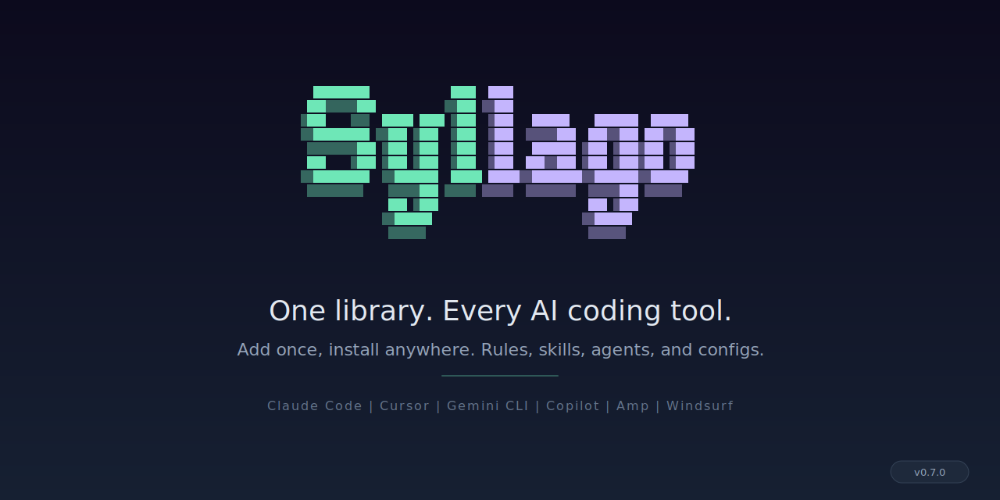

<div align="center">



[](https://github.com/OpenScribbler/syllago/actions/workflows/ci.yml)
[](https://github.com/OpenScribbler/syllago/releases/latest)
[](https://goreportcard.com/report/github.com/OpenScribbler/syllago/cli)
[](LICENSE)
[](https://scorecard.dev/viewer/?uri=github.com/OpenScribbler/syllago)

**Convert, bundle, and share AI coding tool content across providers.**

</div>

## Why Syllago?

AI coding tools like Claude Code, Cursor, Gemini CLI, Copilot, and Amp each store rules, skills, agents, and configurations in their own format. Switching tools -- or rolling out configurations across a team -- means manual copy-pasting and format translation. Syllago automates that: add content once, install it anywhere, and organize it into shareable collections called loadouts.

- **Portable content** -- Add from one tool, install to another. Syllago canonicalizes everything into its own intermediate format, then converts to the target provider's native format automatically.
- **Shared configurations** -- Distribute AI tool content through git-based registries. Push updates once, and your team syncs automatically.
- **Governed distribution** -- Use privacy gates to keep internal content out of public registries. Evaluate untrusted hooks and MCP configs in sandbox isolation before they run. Pipe `--json` output into your CI pipelines and audit workflows.
- **One library** -- Your content lives in a single, provider-neutral library. No duplication across tools, no drift between copies.

For a deeper introduction, see the [documentation site](https://openscribbler.github.io/syllago-docs/).

## Prerequisites

- **OS:** Linux, macOS, or Windows (via WSL)
- **Git:** Required for registry operations and content sharing
- **Go 1.25+:** Only required for `go install` or building from source

## Installation

### Homebrew (macOS)

```bash
brew tap OpenScribbler/tap
brew install syllago
```

### Install script (Linux, macOS, Windows)

```bash
curl -fsSL https://raw.githubusercontent.com/OpenScribbler/syllago/main/install.sh | sh
```

Downloads the latest release binary, verifies the SHA-256 checksum, and installs to `~/.local/bin`. Override the install location with `INSTALL_DIR`:

```bash
INSTALL_DIR=/usr/local/bin sh install.sh
```

### go install

```bash
go install github.com/OpenScribbler/syllago/cli/cmd/syllago@latest
```

### From source

```bash
git clone https://github.com/OpenScribbler/syllago.git
cd syllago
make setup    # configure git hooks (gofmt pre-commit check)
make build
```

## Quick Start

**Scenario:** You have Claude Code rules and skills you want to use in Cursor and Gemini CLI.

```bash
# Step 0: Initialize your syllago content repository (first time only)
syllago init

# Step 1: See what content Claude Code has
syllago add --from claude-code
# Discovered content from Claude Code:
#   Rules (3): my-coding-rules, typescript-standards, security-policy
#   Skills (2): research-skill, code-review
#   ...

# Step 2: Add all of it to your syllago library
syllago add --all --from claude-code

# Step 3: Install a rule to Cursor (auto-converts to .mdc format)
syllago install my-coding-rules --to cursor

# Step 4: Install a skill to Gemini CLI (auto-converts to Gemini's SKILL.md format)
syllago install research-skill --to gemini-cli
```

Or skip the CLI and browse everything interactively:

```bash
syllago   # launches the TUI
```

## How It Works

Syllago uses a **hub-and-spoke conversion model**. When you add content from a provider, syllago converts it into its own canonical format -- a provider-neutral intermediate representation. When you install that content to a different provider, syllago converts from canonical to the target's native format. This means adding support for a new provider only requires two conversions (to/from canonical), not N-to-N mappings between every provider pair.

Specification files define how each content type looks in canonical form. See the [canonical format docs](https://openscribbler.github.io/syllago-docs/) for details.

### The library

Everything you add goes into your **library** (`~/.syllago/content/`). Your library is your single source of truth -- provider-neutral, deduplicated, and ready to install to any supported provider.

### Commands

Syllago's CLI is organized around a content lifecycle:

| Step | Command | What it does |
|------|---------|-------------|
| **Discover** | `syllago add --from <provider>` | Scans a provider's config directory and shows you what content exists |
| **Add** | `syllago add --all --from <provider>` | Copies content into your library, converting to canonical format |
| **Install** | `syllago install <item> --to <provider>` | Writes a library item to a provider's config directory in its native format |
| **Convert** | `syllago convert <item> --to <provider>` | Converts content for a provider without installing it |
| **Share** | `syllago share <item>` | Contributes library content to a team repo or registry |

See the full [command reference](#all-commands) below or the [CLI docs](https://openscribbler.github.io/syllago-docs/) for detailed usage.

## Supported Providers

| Tool | Rules | Skills | Agents | MCP | Hooks | Commands |
|------|:-----:|:------:|:------:|:---:|:-----:|:--------:|
| Claude Code | ✅ | ✅ | ✅ | ✅ | ✅ | ✅ |
| Gemini CLI | ✅ | ✅ | ✅ | ✅ | ✅ | ✅ |
| Copilot CLI | ✅ | ✅ | ✅ | ✅ | ✅ | ✅ |
| Codex | ✅ | ✅ | ✅ | ✅ | ✅ | ✅ |
| Cursor | ✅ | ✅ | ✅ | ✅ | ✅ | ✅ |
| Amp | ✅ | ✅ | - | ✅ | - | - |
| Windsurf | ✅ | ✅ | - | ✅ | ✅ | - |
| Kiro | ✅ | ✅ | ✅ | ✅ | ✅ | - |
| OpenCode | ✅ | ✅ | ✅ | ✅ | - | ✅ |
| Roo Code | ✅ | ✅ | ✅ | ✅ | - | - |
| Cline | ✅ | - | - | ✅ | ✅ | - |
| Zed | ✅ | - | - | ✅ | - | - |

## Content Types

| Type | What it is |
|------|------------|
| Rules | System prompts and custom instructions (e.g., "always use TypeScript strict mode") |
| Skills | Multi-file workflow packages (e.g., a code review workflow with templates and scripts) |
| Agents | AI agent definitions and personas (e.g., a "security reviewer" agent) |
| MCP Servers | Model Context Protocol server configurations |
| Hooks | Event-driven automation scripts that run before/after tool actions |
| Commands | Custom slash commands (e.g., `/deploy`) |

Use `syllago compat <item>` to see which providers support a specific content item and what changes during conversion.

For full conversion details, see the [compatibility docs](https://openscribbler.github.io/syllago-docs/).

## Conversion Examples

Syllago automatically converts between provider-specific formats. Here's what that looks like in practice:

**Cursor rule (.mdc) → Claude Code (.md)**

```
# Input (Cursor)                    # Output (Claude Code)
---                                 ---
description: TS conventions         paths:
alwaysApply: false                      - '*.ts'
globs: "*.ts, *.tsx"                    - '*.tsx'
---                                 ---

Use strict TypeScript.              Use strict TypeScript.
```

Cursor uses `globs` as a comma-separated string with `alwaysApply`. Claude Code uses a `paths` YAML array. The body content passes through unchanged.

**Cursor rule → Windsurf rule**

```
# Input (Cursor)                    # Output (Windsurf)
---                                 ---
description: TS conventions         trigger: glob
alwaysApply: false                  description: TS conventions
globs: "*.ts, *.tsx"                globs: '*.ts, *.tsx'
---                                 ---

Use strict TypeScript.              Use strict TypeScript.
```

Windsurf uses `trigger: glob` instead of `alwaysApply: false`. The `globs` format is the same.

**Cursor rule → Copilot (.instructions.md)**

```
# Input (Cursor)                    # Output (Copilot)
---                                 ---
description: TS conventions         applyTo: '*.ts, *.tsx'
alwaysApply: false                  ---
globs: "*.ts, *.tsx"
---                                 Use strict TypeScript.

Use strict TypeScript.
```

Copilot uses `applyTo` instead of `globs`. The `description` field is dropped (Copilot doesn't use it for scoping).

Try it yourself: `syllago convert ./my-rule.mdc --from cursor --to windsurf`

## Collections

Collections let you organize and distribute content beyond individual items.

### Library

Your library (`~/.syllago/content/`) stores everything you've added in syllago's canonical format. Install any item to any supported provider from here. The library lives locally on your machine.

### Loadouts

A **loadout** bundles multiple content items and applies them as a unit. Package a complete AI tool setup (rules + skills + hooks + MCP configs) for a specific workflow or role. Pass `--try` to preview a loadout temporarily -- syllago auto-reverts when you're done.

### Registries

A **registry** is a git repository that distributes syllago content. Push curated configurations to a registry, and your team syncs them with `syllago registry sync`. Mark registries as public or private -- syllago's privacy gates block content from private registries from reaching public ones.

## Features

- **Cross-provider conversion** -- Add content from one tool, install to another. Syllago handles format differences (Cursor's `.mdc`, Codex's TOML, Kiro's JSON, Amp's `AGENTS.md`, etc.)
- **Interactive TUI** -- Browse, search, install, and manage content with card grids, mouse support, and keyboard navigation
- **Sandbox** -- Run AI CLI tools in isolated environments with filesystem, network, and environment filtering (Linux)
- **Registry privacy** -- Syllago detects content from private registries and blocks it from reaching public ones
- **`--json` output** -- Pipe any command's output into scripts, CI pipelines, or other automation

## All Commands

| Command | Description |
|---------|-------------|
| `syllago` | Launch the interactive TUI |
| `syllago add` | Discover and add content from a provider |
| `syllago install` | Activate library content in a provider |
| `syllago uninstall` | Deactivate content from a provider |
| `syllago remove` | Remove content from your library |
| `syllago convert` | Convert content between provider formats |
| `syllago share` | Contribute library content to a team repo or registry |
| `syllago loadout` | Apply, create, and manage loadouts |
| `syllago registry` | Manage git-based content registries |
| `syllago sandbox` | Run AI CLI tools in isolated sandboxes (Linux) |
| `syllago sync-and-export` | Sync registries then install content to a provider (CI/automation) |
| `syllago init` | Initialize syllago for a project |
| `syllago create` | Scaffold a new content item |
| `syllago inspect` | Show details about a content item |
| `syllago list` | List content items in the library |
| `syllago compat` | Show provider compatibility matrix for a content item |
| `syllago explain` | Show documentation for an error code |
| `syllago config` | View and edit configuration |
| `syllago update` | Update syllago to the latest release |
| `syllago info` | Show capabilities, detected providers, library location |
| `syllago doctor` | Diagnose setup problems (providers, config, integrity) |
| `syllago completion` | Generate shell autocompletion scripts |
| `syllago version` | Print version |

### Global Flags

```
--json        Output in JSON format
--no-color    Disable color output
-q, --quiet   Suppress non-essential output
-v, --verbose Verbose output
```

### Example Workflows

```bash
# Add all content from Claude Code
syllago add --from claude-code

# Add only rules from Cursor
syllago add rules --from cursor

# Install a skill to Gemini CLI (auto-converts format)
syllago install my-skill --to gemini-cli

# Browse and install from a shared team registry
syllago registry add https://github.com/your-team/ai-configs.git
syllago registry sync
syllago registry items --type skills

# Apply a loadout temporarily (auto-reverts when done)
syllago loadout apply my-loadout --try

# Convert content for a specific provider without installing
syllago convert my-rule --to windsurf

# Check which providers support a specific content item
syllago compat my-hook
```

## TUI Keyboard Shortcuts

| Key | Action |
|-----|--------|
| `Up`/`Down` or `j`/`k` | Navigate lists and scroll |
| `PgUp`/`PgDn` | Jump a full viewport |
| `Enter` | Open item / confirm action |
| `Esc` | Go back one level |
| `Tab`/`Shift+Tab` | Switch focus between sidebar and content |
| `/` | Search (live filtering with match count) |
| `?` | Toggle keyboard shortcut help |
| `Home`/`End` | Jump to first/last item |
| `Ctrl+N`/`Ctrl+P` | Next/previous item in detail view |
| `i` | Install selected item |
| `u` | Uninstall selected item |
| `a` | Add content (context-specific) |
| `r` | Remove item |
| `c` | Copy content to clipboard |
| `H` | Toggle hidden items |

Mouse support: click to select cards, items, tabs, breadcrumbs, and modal buttons. Scroll wheel works in all scrollable areas.

## Configuration

Syllago uses two config files:

- **Project:** `.syllago/config.json` -- providers and registries for this project
- **Global:** `~/.syllago/config.json` -- default providers, global library settings

Run `syllago init` for first-time setup. The init wizard helps you select providers and add registries.

### Custom Provider Paths

If your AI tools are installed at non-default locations:

```bash
syllago config paths set claude-code --base-dir /custom/path
syllago config paths show
```

## Accessibility

Every operation works through CLI commands with `--json` output for scripting and assistive technology. The TUI uses ANSI rendering; if you use a screen reader, we recommend running CLI commands directly. Disable colors with `NO_COLOR=1` or `--no-color`. We're exploring a screen-reader-compatible TUI mode -- [feedback welcome](https://github.com/OpenScribbler/syllago/issues).

## Security and Supply Chain

Syllago does not operate any registry or marketplace. Third-party registries are unverified -- review content before installing, especially hooks and MCP configs which execute code by design.

**What we do to keep the tool itself trustworthy:**

- **Signed releases** -- We sign all release binaries with [Sigstore cosign](https://www.sigstore.dev/) (keyless). Verify with: `cosign verify-blob --bundle checksums.txt.bundle checksums.txt`
- **SHA-256 checksums** -- Every release ships with `checksums.txt` for independent verification
- **Pinned CI dependencies** -- We pin all GitHub Actions to full-length commit SHAs, not mutable version tags
- **Automated vulnerability scanning** -- govulncheck runs in CI and catches known-vulnerable dependencies before merge
- **Dependency updates** -- Dependabot monitors and patches dependency security issues automatically
- **Registry privacy gates** -- Syllago tags content from private registries and blocks it from reaching public ones
- **Sandbox isolation** -- Run AI CLI tools in bubblewrap-based sandboxes with filesystem, network, and environment filtering (Linux)

See [SECURITY.md](SECURITY.md) for the full security policy, threat model, and how to report vulnerabilities.

## Roadmap

What's done and what's next:

- **Privacy and integrity** -- registry privacy gates, content integrity hashes, audit trail (done)
- **Distribution** -- bulk install, `add --from shared`, provider-to-provider conversion, SBOM (done)
- **Platform** -- `syllago doctor`, enhanced `syllago info`, dependency review CI (done)
- **Security** -- trust tiers, hook signing and verification, script scanning, policy engine (next)
- **Providers** -- VS Code Copilot, Qwen Code, Crush, Kimi CLI, Trae Agent, and more
- **Specs** -- formal specs for all canonical formats (hooks spec is already drafted)

See [ROADMAP.md](ROADMAP.md) for the full roadmap with status tracking.

## Contributing

We welcome ideas, bug reports, and feature suggestions -- open an issue to get started. We accept pull requests from [vouched contributors](https://github.com/mitchellh/vouch). See [CONTRIBUTING.md](CONTRIBUTING.md) for details on how to get involved.

## License

Apache 2.0 -- see [LICENSE](LICENSE) for full text.
