# Mermaid Pattern Templates

Mermaid templates for presentation diagrams. Use when precise positioning isn't required and the diagram type fits Mermaid's capabilities.

## When to Use Mermaid vs SVG

| Scenario | Recommendation |
|----------|----------------|
| Flowcharts, decision trees | Mermaid |
| Architecture/system diagrams | Mermaid |
| Sequence diagrams | Mermaid |
| Entity relationships | Mermaid |
| Branded icons/custom shapes | SVG |
| Precise pixel positioning | SVG |
| Complex custom styling | SVG |
| Metrics cards, dashboards | SVG |

## Theme Configuration

### RSAC 2026 Theme

Apply at the start of any Mermaid diagram:

```mermaid
%%{init: {'theme': 'base', 'themeVariables': {
  'primaryColor': '#2464C7',
  'primaryTextColor': '#FFFFFF',
  'primaryBorderColor': '#051464',
  'secondaryColor': '#A6CE38',
  'secondaryTextColor': '#000000',
  'tertiaryColor': '#CCD8EA',
  'tertiaryTextColor': '#000000',
  'lineColor': '#000000',
  'textColor': '#000000',
  'fontFamily': 'Calibri, Arial, sans-serif',
  'fontSize': '18px'
}}}%%
```

### Corporate Theme

```mermaid
%%{init: {'theme': 'base', 'themeVariables': {
  'primaryColor': '#1976D2',
  'primaryTextColor': '#FFFFFF',
  'secondaryColor': '#00897B',
  'tertiaryColor': '#F5F5F5',
  'lineColor': '#212121',
  'textColor': '#212121',
  'fontFamily': 'Arial, Helvetica, sans-serif',
  'fontSize': '18px'
}}}%%
```

### Dark Mode Theme

```mermaid
%%{init: {'theme': 'dark', 'themeVariables': {
  'primaryColor': '#BB86FC',
  'primaryTextColor': '#000000',
  'secondaryColor': '#03DAC6',
  'tertiaryColor': '#1E1E1E',
  'lineColor': '#FFFFFF',
  'textColor': '#FFFFFF',
  'fontFamily': 'Arial, Helvetica, sans-serif',
  'fontSize': '18px'
}}}%%
```

---

## Pattern: Process Flow

### Horizontal Flow (LR)

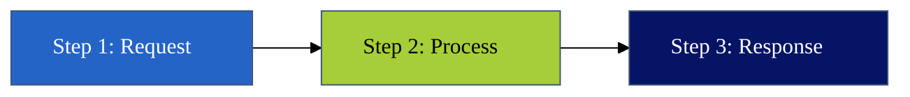

### Vertical Flow (TB)

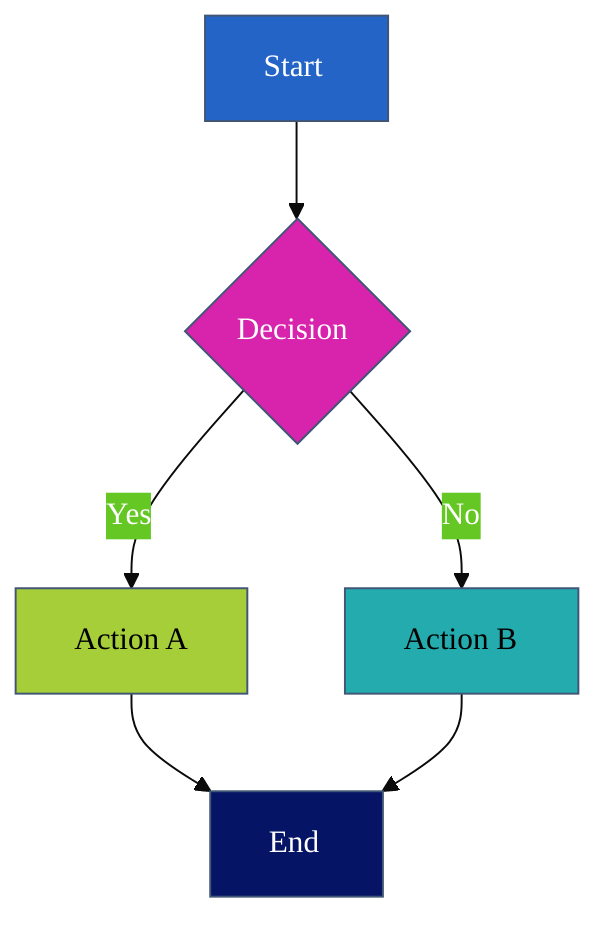

### With Subgraphs

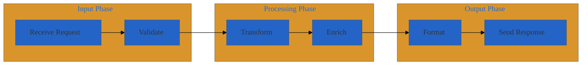

---

## Pattern: Architecture Layers

### System Context (C4 Style)

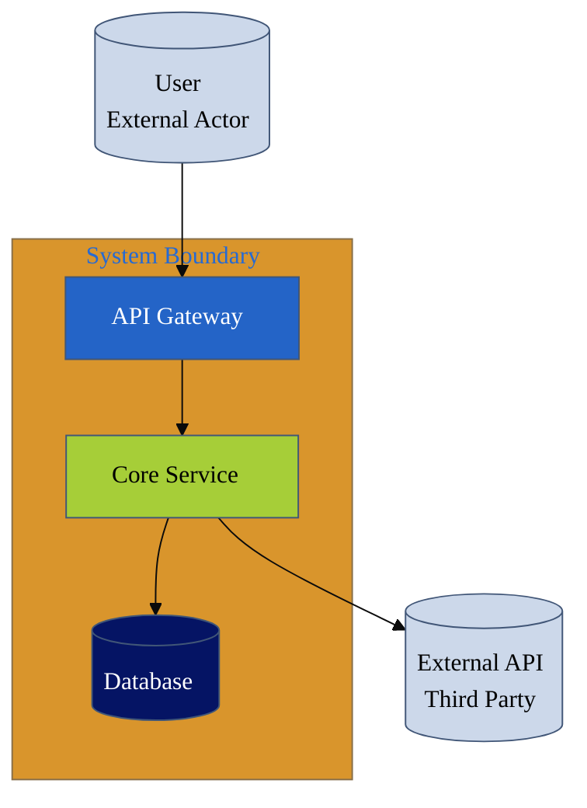

### Layered Architecture

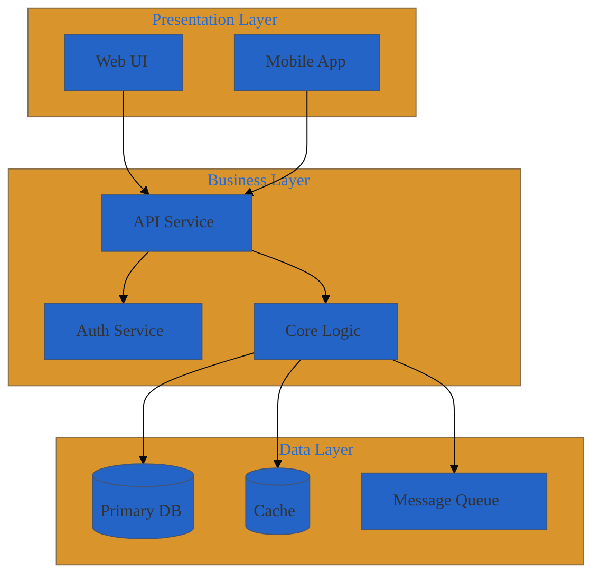

---

## Pattern: Sequence Diagram

### Basic Request/Response

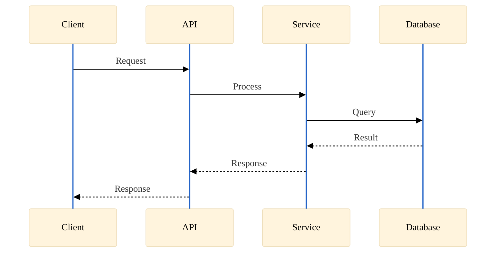

### With Authentication

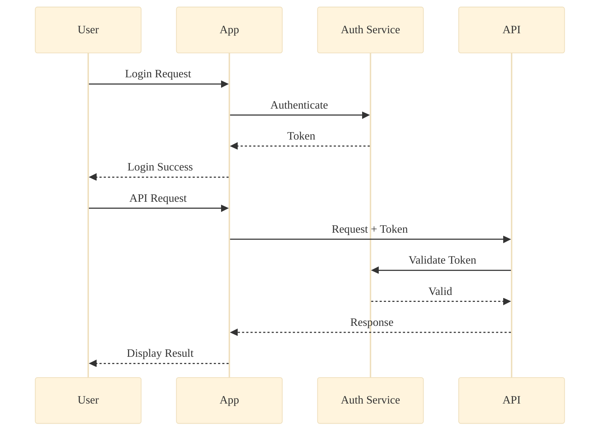

### With Notes and Loops

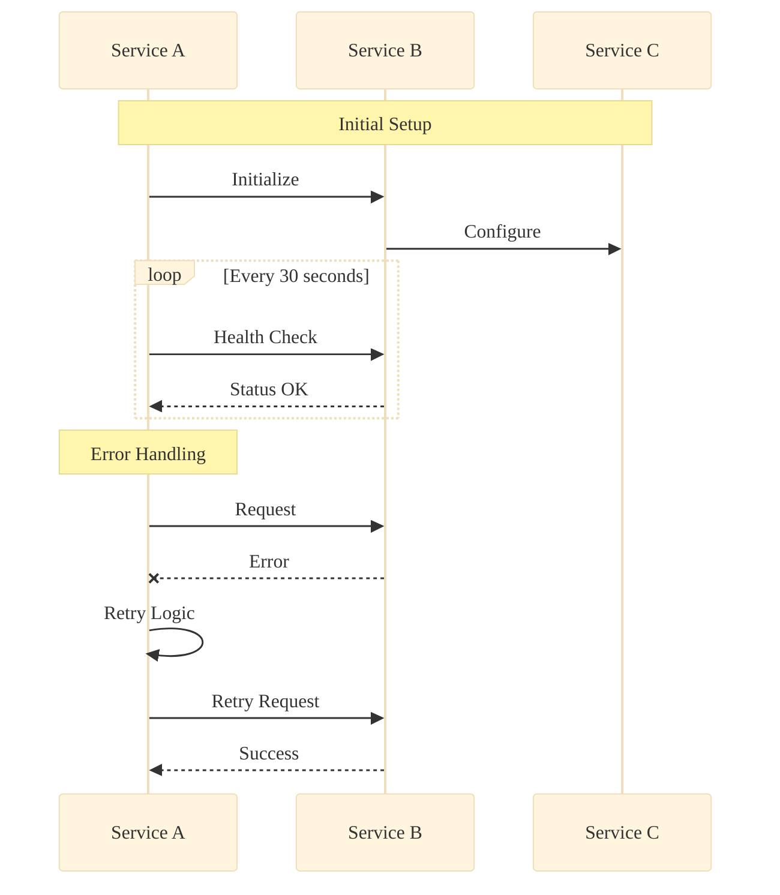

---

## Pattern: Entity Relationship

### Basic ERD

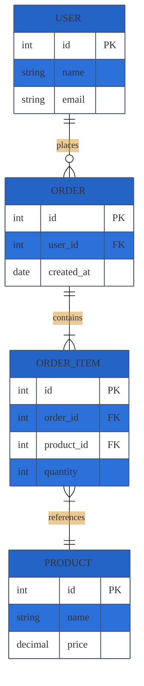

---

## Pattern: State Diagram

### Simple State Machine

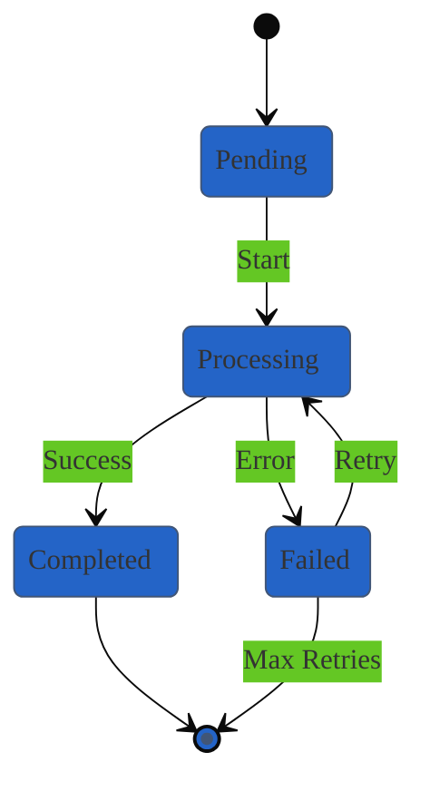

---

## Styling Reference

### Node Styles

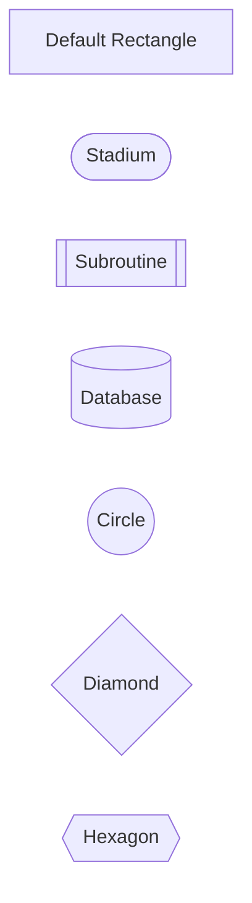

### Style Application

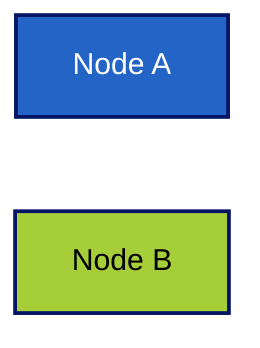

### Class-Based Styling

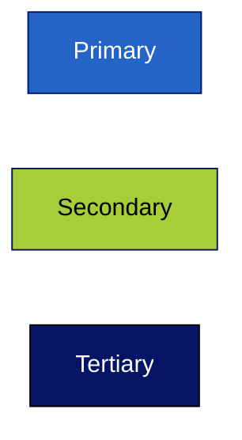

---

## Accessibility Notes for Mermaid

Mermaid diagrams are rendered as SVG, but accessibility depends on the rendering context:

1. **Alt text**: Always provide alt text when embedding diagrams
2. **Font size**: Use `fontSize: '18px'` minimum in theme config
3. **Contrast**: Verify node fill colors meet contrast requirements
4. **Color coding**: Add labels to nodes, don't rely on color alone
5. **Complexity**: Keep diagrams simple; split complex flows

### Recommended Alt Text Format

```markdown

```
